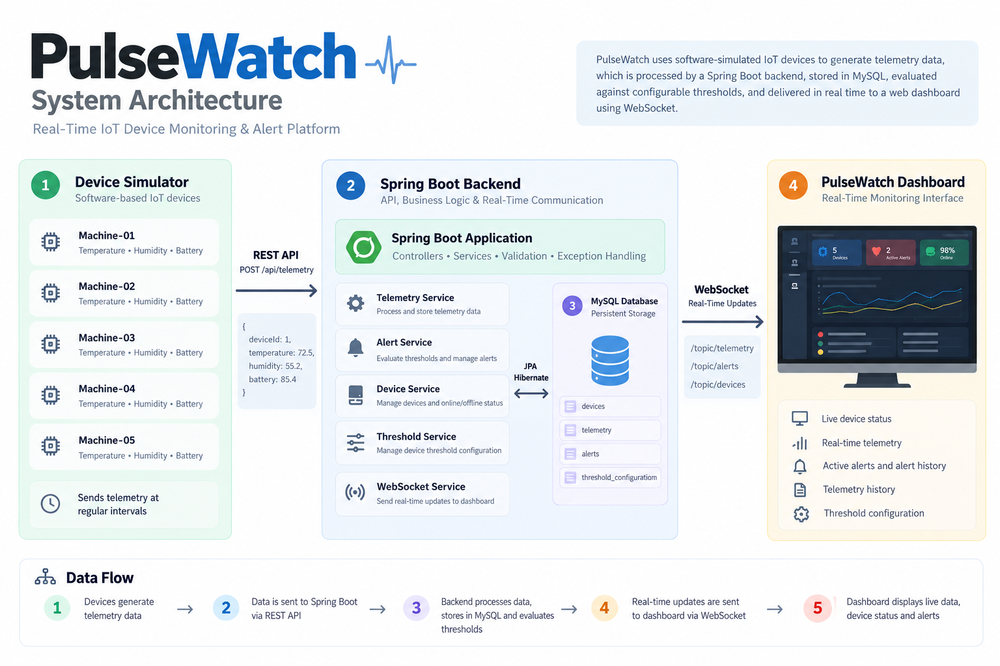

# PulseWatch

### Real-Time IoT Device Monitoring & Alert Platform

PulseWatch is a software-based IoT device monitoring platform built with Java and Spring Boot.

It uses simulated IoT devices that periodically generate temperature, humidity, and battery readings. The readings are sent to a Spring Boot backend through REST APIs, stored in MySQL, evaluated against configurable thresholds, and used to generate alerts.

The dashboard receives real-time telemetry, device-status, and alert updates through WebSocket without requiring a page refresh.
# PulseWatch

### Real-Time IoT Device Monitoring & Alert Platform

[](https://www.oracle.com/java/)
[](https://spring.io/projects/spring-boot)
[](https://www.mysql.com/)
[](https://developer.mozilla.org/en-US/docs/Web/API/WebSocket)

> A software-based IoT monitoring platform that simulates connected devices, processes telemetry in real time, detects abnormal conditions, manages alerts, and provides a live monitoring dashboard.

**Live Demo:**  
https://pulsewatch-d1yd.onrender.com/

**GitHub:**  
https://github.com/Kushalc05/PulseWatch

---

## Overview

PulseWatch is a backend-focused IoT monitoring platform built with **Java and Spring Boot**.

Instead of relying on physical hardware, the system uses **software-simulated IoT devices** that periodically generate:

- Temperature
- Humidity
- Battery level

The generated telemetry is processed by the Spring Boot backend, validated, stored in MySQL, evaluated against configurable thresholds, and used to generate alerts when abnormal conditions persist.

The web dashboard receives telemetry, device-status, and alert updates in real time through **WebSocket**, allowing monitoring without manually refreshing the page.

The project is designed to demonstrate practical backend engineering concepts such as:

- REST API design
- Layered architecture
- Database relationships
- Business logic
- Input validation
- Exception handling
- Threshold-based monitoring
- Alert lifecycle management
- Real-time communication
- IoT device simulation

---

# ✨ Key Features

### Device Monitoring

- Register and manage simulated IoT devices
- Track device locations
- Monitor device online/offline status
- Track the latest telemetry timestamp

### Telemetry Processing

- Temperature monitoring
- Humidity monitoring
- Battery monitoring
- REST-based telemetry ingestion
- Input validation
- Persistent telemetry history
- Device-specific telemetry retrieval

### Intelligent Alerting

- Configurable thresholds per device
- Persistent abnormal-reading detection
- Alert severity levels
- Duplicate alert prevention
- Automatic alert resolution after recovery
- Alert acknowledgement and resolution
- Complete alert history

### Real-Time Dashboard

- Live device status
- Live telemetry readings
- Active alerts
- Alert history
- Telemetry history
- Real-time updates without page refresh
- WebSocket-based communication

### Reliability & Validation

- Request validation
- Device existence validation
- Centralized exception handling
- Device offline detection
- Controlled alert lifecycle

---

# 🛠️ Tech Stack

## Backend

- **Java 25**
- **Spring Boot**
- **Spring Data JPA**
- **Hibernate**
- **REST APIs**
- **WebSocket**
- **Maven**

## Database

- **MySQL 8**

## Frontend

- **HTML**
- **CSS**
- **JavaScript**

## Development & Testing

- **Visual Studio Code**
- **MySQL Workbench**
- **Postman**
- **Git**
- **GitHub**

## Deployment

- **Render**
- **Aiven MySQL**
- **Docker**

Docker is used only as the deployment packaging mechanism for the Spring Boot application.

---

# 🏗️ System Architecture

PulseWatch follows a layered Spring Boot architecture where simulated devices generate telemetry, the backend processes the data, and the dashboard receives real-time updates.

```text
                    ┌──────────────────────┐
                    │   Virtual Devices    │
                    │──────────────────────│
                    │ Temperature           │
                    │ Humidity              │
                    │ Battery               │
                    └──────────┬───────────┘
                               │
                               │ REST
                               ▼
                    ┌──────────────────────┐
                    │     Spring Boot      │
                    │       Backend        │
                    └──────────┬───────────┘
                               │
              ┌────────────────┼────────────────┐
              │                │                │
              ▼                ▼                ▼
      ┌──────────────┐ ┌──────────────┐ ┌──────────────┐
      │   Telemetry  │ │    Alert     │ │    Device    │
      │    Service   │ │    Service   │ │    Service   │
      └──────┬───────┘ └──────┬───────┘ └──────┬───────┘
             │                │                │
             └────────────────┼────────────────┘
                              │
                              ▼
                     ┌─────────────────┐
                     │      MySQL      │
                     │    Database     │
                     └────────┬────────┘
                              │
                              │ WebSocket
                              ▼
                  ┌────────────────────────┐
                  │   PulseWatch Dashboard │
                  │                        │
                  │ Live Telemetry         │
                  │ Device Status          │
                  │ Active Alerts          │
                  │ Alert History          │
                  └────────────────────────┘
> PulseWatch uses software-simulated IoT devices to demonstrate telemetry ingestion, monitoring, threshold-based alerting, and real-time dashboard updates.

---

## Features

- Software-simulated IoT devices
- Device registration and monitoring
- Temperature, humidity, and battery telemetry
- REST API for telemetry ingestion
- Telemetry storage using MySQL
- Configurable monitoring thresholds
- Automatic alert generation
- Alert severity levels
- Alert lifecycle management
- Alert acknowledgement and resolution
- Duplicate alert prevention
- Automatic alert resolution after recovery
- Device online/offline detection
- Real-time dashboard updates using WebSocket
- Telemetry history
- Alert history
- Centralized exception handling
- Input validation

---

## Tech Stack

### Backend

- Java 25
- Spring Boot
- Spring Data JPA
- Hibernate
- REST APIs
- WebSocket
- Maven

### Database

- MySQL 8

### Frontend

- HTML
- CSS
- JavaScript

### Development Tools

- Visual Studio Code
- MySQL Workbench
- Postman
- Git & GitHub

---

## System Architecture

```text
                 +----------------------+
                 |   Device Simulator   |
                 |----------------------|
                 | Temperature          |
                 | Humidity             |
                 | Battery              |
                 +----------+-----------+
                            |
                            | REST API
                            v
                 +----------------------+
                 |    Spring Boot       |
                 |      Backend         |
                 +----------+-----------+
                            |
            +---------------+---------------+
            |               |               |
            v               v               v
     +-------------+  +-------------+  +-------------+
     |  Telemetry  |  |    Alert    |  |   Device    |
     |   Service   |  |   Service   |  |   Service   |
     +------+------+  +------+------+  +------+------+
            |                |               |
            +----------------+---------------+
                             |
                             v
                     +---------------+
                     |     MySQL     |
                     +---------------+

                             |
                             | WebSocket
                             v

                 +----------------------+
                 |   PulseWatch Web     |
                 |      Dashboard       |
                 +----------------------+
```

---
### Architecture Diagram



## How It Works

### 1. Device Simulation

The device simulator represents multiple virtual IoT devices.

Each device periodically generates:

- Temperature
- Humidity
- Battery level

The simulator sends these readings to the backend through:

```text
POST /api/telemetry
```

---

### 2. Telemetry Processing

When telemetry reaches the backend:

1. The device is identified.
2. The telemetry values are validated.
3. The device is marked as online.
4. The latest telemetry timestamp is updated.
5. The telemetry is stored in MySQL.
6. The readings are checked against the device's configured thresholds.
7. Real-time telemetry is sent to connected dashboard clients.

---

### 3. Threshold Monitoring

Each device can have its own threshold configuration.

The default thresholds are:

| Metric | Default Threshold |
|--------|-------------------|
| Temperature | 80°C |
| Humidity | 80% |
| Battery | 20% |

Thresholds can be updated through the REST API.

---

## Alert System

PulseWatch monitors telemetry and creates alerts when abnormal conditions persist.

### Alert Types

- `HIGH_TEMPERATURE`
- `HIGH_HUMIDITY`
- `LOW_BATTERY`

### Severity

- LOW
- MEDIUM
- HIGH
- CRITICAL

### Alert Lifecycle

```text
        Abnormal readings
               |
               v
             OPEN
               |
          Acknowledge
               |
               v
         ACKNOWLEDGED
               |
            Resolve
               |
               v
           RESOLVED
```

PulseWatch requires consecutive abnormal readings before creating an alert. This helps prevent a single temporary reading from immediately generating an alert.

Similarly, recovery requires consecutive normal readings before an active alert is automatically resolved.

---

## Device Online / Offline Detection

Each device stores the timestamp of its latest telemetry.

The backend periodically checks when telemetry was last received.

If telemetry has not been received within the configured timeout period, the device is marked:

```text
OFFLINE
```

When telemetry starts arriving again, the device is marked:

```text
ONLINE
```

The status change is also sent to the dashboard through WebSocket.

---

## Real-Time Updates

PulseWatch uses WebSocket to update the dashboard without requiring manual page refreshes.

The backend publishes updates for:

```text
/topic/telemetry
/topic/alerts
```

This allows the dashboard to receive:

- New telemetry
- Device status changes
- New alerts
- Alert acknowledgement
- Alert resolution

in real time.

---

## REST API

### Devices

#### Register Device

```http
POST /api/devices
```

Parameters:

```text
deviceName
location
```

#### Get Devices

```http
GET /api/devices
```

---

### Telemetry

#### Submit Telemetry

```http
POST /api/telemetry
```

Example request:

```json
{
    "deviceId": 1,
    "temperature": 72.5,
    "humidity": 55.2,
    "battery": 85.4
}
```

#### Get All Telemetry

```http
GET /api/telemetry
```

#### Get Device Telemetry

```http
GET /api/telemetry/device/{deviceId}
```

---

### Alerts

#### Get All Alerts

```http
GET /api/alerts
```

#### Get Active Alerts

```http
GET /api/alerts/active
```

#### Acknowledge Alert

```http
PUT /api/alerts/{id}/acknowledge
```

#### Resolve Alert

```http
PUT /api/alerts/{id}/resolve
```

---

### Threshold Configuration

#### Get Device Thresholds

```http
GET /api/thresholds/device/{deviceId}
```

#### Update Device Thresholds

```http
PUT /api/thresholds/device/{deviceId}
```

Example:

```json
{
    "temperatureThreshold": 80,
    "humidityThreshold": 80,
    "batteryThreshold": 20
}
```

---

## Project Structure

```text
PulseWatch/
│
├── src/
│   ├── main/
│   │   ├── java/
│   │   │   └── com/
│   │   │       └── pulsewatch/
│   │   │           │
│   │   │           ├── config/
│   │   │           │   └── WebSocketConfig.java
│   │   │           │
│   │   │           ├── controller/
│   │   │           │   ├── AlertController.java
│   │   │           │   ├── DeviceController.java
│   │   │           │   ├── TelemetryController.java
│   │   │           │   └── ThresholdConfigurationController.java
│   │   │           │
│   │   │           ├── dto/
│   │   │           │   ├── TelemetryRequest.java
│   │   │           │   └── ThresholdConfigurationRequest.java
│   │   │           │
│   │   │           ├── entity/
│   │   │           │   ├── Alert.java
│   │   │           │   ├── AlertSeverity.java
│   │   │           │   ├── AlertStatus.java
│   │   │           │   ├── Device.java
│   │   │           │   ├── DeviceStatus.java
│   │   │           │   ├── Telemetry.java
│   │   │           │   └── ThresholdConfiguration.java
│   │   │           │
│   │   │           ├── exception/
│   │   │           │   ├── GlobalExceptionHandler.java
│   │   │           │   └── ResourceNotFoundException.java
│   │   │           │
│   │   │           ├── repository/
│   │   │           │   ├── AlertRepository.java
│   │   │           │   ├── DeviceRepository.java
│   │   │           │   ├── TelemetryRepository.java
│   │   │           │   └── ThresholdConfigurationRepository.java
│   │   │           │
│   │   │           ├── service/
│   │   │           │   ├── AlertService.java
│   │   │           │   ├── DeviceService.java
│   │   │           │   ├── DeviceStatusMonitorService.java
│   │   │           │   ├── TelemetryService.java
│   │   │           │   ├── ThresholdConfigurationService.java
│   │   │           │   └── WebSocketService.java
│   │   │           │
│   │   │           └── PulsewatchApplication.java
│   │   │
│   │   └── resources/
│   │       ├── static/
│   │       │   ├── index.html
│   │       │   ├── dashboard.js
│   │       │   └── ...
│   │       │
│   │       └── application.properties
│   │
│   └── test/
│
├── pom.xml
├── mvnw
├── mvnw.cmd
├── .gitignore
└── README.md
```

---

## Running the Project

### Prerequisites

Make sure the following are installed:

- Java 25
- MySQL 8
- Maven or Maven Wrapper

Create the database:

```sql
CREATE DATABASE pulsewatch;
```

---

### Configure Database

Update:

```text
src/main/resources/application.properties
```

with your MySQL credentials.

Example:

```properties
spring.application.name=pulsewatch

spring.datasource.url=jdbc:mysql://localhost:3306/pulsewatch
spring.datasource.username=root
spring.datasource.password=YOUR_MYSQL_PASSWORD

spring.jpa.hibernate.ddl-auto=update
spring.jpa.show-sql=false
spring.jpa.properties.hibernate.format_sql=true
```

Do not commit your actual database password to GitHub.

---

### Start the Backend

From the project root:

```powershell
.\mvnw.cmd spring-boot:run
```

The backend runs on:

```text
http://localhost:8080
```

---

### Run the Device Simulator

Run:

```text
DeviceSimulator.java
```

The simulator periodically sends telemetry from the virtual devices to the backend.

---

### Open the Dashboard

Open the PulseWatch web application through the running Spring Boot application.

The dashboard displays:

- Device status
- Current telemetry
- Monitoring metrics
- Active alerts
- Alert history
- Telemetry history
- Real-time updates

---

## Validation & Error Handling

PulseWatch validates incoming telemetry and threshold values before processing them.

Examples of validation include:

- Temperature range validation
- Humidity range validation
- Battery range validation
- Required request fields
- Device existence validation

The backend also uses centralized exception handling for resource-related errors.

---

## Database Model

The main entities are:

```text
Device
   |
   +---- Telemetry
   |
   +---- Alert
   |
   +---- ThresholdConfiguration
```

A device can have:

- Many telemetry records
- Many alerts
- One threshold configuration

---

## Design Approach

PulseWatch follows a layered Spring Boot architecture:

```text
Controller
    ↓
Service
    ↓
Repository
    ↓
Database
```

### Controller

Handles HTTP requests and responses.

### Service

Contains business logic such as telemetry processing, threshold checking, alert generation, and device monitoring.

### Repository

Uses Spring Data JPA to communicate with the database.

### Entity

Represents persistent database data.

### DTO

Controls and validates incoming API request data.

---

## Current Limitations

PulseWatch is designed as a focused software project rather than a production-scale IoT infrastructure platform.

Current limitations include:

- Devices are software-simulated rather than physical IoT hardware.
- The device simulator runs locally.
- Alert reading counters are maintained in application memory.
- WebSocket uses Spring's simple message broker.
- Authentication and authorization are not implemented.

These decisions keep the project focused on backend engineering, monitoring logic, REST APIs, database design, and real-time communication.

---

## Future Improvements

Possible future improvements include:

- Persistent alert monitoring state
- User authentication and authorization
- More advanced device management
- Historical telemetry visualization
- Notification integrations
- Deployment to a cloud environment
- Support for real IoT communication protocols
- Scalable message processing for large device fleets

---

## Project Goal

PulseWatch was built to demonstrate practical backend development concepts including:

- Java
- Spring Boot
- REST API design
- Spring Data JPA
- Hibernate
- MySQL
- Validation
- Exception handling
- Business logic
- WebSocket communication
- Real-time monitoring
- Database relationships
- Software-based IoT simulation

---

## Author

**Kushal C**

Computer Science & Engineering Graduate

GitHub: `https://github.com/kushalc05`

LinkedIn: `https://www.linkedin.com/in/kushal-c-sde`
